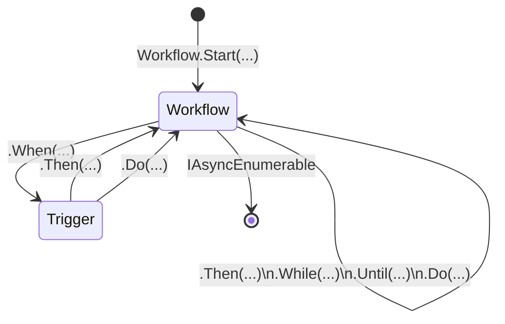

# *Swolfkrow*

*Swolfkrow* (pronounced */ˈwɜː(r)kˌfləʊs/*) is a Domain Specific Language (DSL) designed to declaratively compose [asynchronous workflows](#asynchronous-workflows) through a fluent API.

## Asynchronous workflows

In the context of *Swolfkrow*, asynchronous workflows can be understood as asynchronous computations that yield an asynchronous stream of *events* signaling progress, outcomes, and errors.

In practice, asynchronous workflows are objects that implement the [`IAsyncEnumerable<out T>`][system.collections.generic.iasyncenumerable] interface, with a few semantic constraints:

- The generic type `T`, named `TEvent` across the *Swolfkrow* library, represents the base type from which all events potentially yielded by the asynchronous workflow derive.
- Yielded `TEvent` objects are assumed to describe relevant events occured during the asynchronous workflow's execution.
- When enumerated, asynchronous workflows may execute arbitrary asynchronous logic in between consecutively yielded `TEvent` objects.

*Swolfkrow* provides the programmatic glue required to declaratively compose simpler asynchronous workflows together into more complex ones. It also provides support to build asynchronous workflows from other primitives, like [`IEnumerable<TEvent>`][system.collections.generic.ienumerable], [`Task<TEvent>`][system.threading.tasks.task], or [`ValueTask<TEvent>`][system.threading.tasks.valuetask].

## Fluent API

*Swolfkrow*'s fluent API can be visualized as a state machine, where the (arguably less relevant) supporting classes are states, and the composition operators are transitions:



The entry point to the DSL is always one of the many `Workflow.Start` factory method overloads, all of which return an initial [`Workflow<Event>`](#the-workflowtevent-class) instance.

The `Workflow<TEvent>` class exposes a number of operators that perform single-step compositions and return a new `Workflow<TEvent>` instance:

- Continuations: `workflow.Then(...)`
- Side-effects: `workflow.Do(...)`
- Interruptions: `workflow.While(...)`, `workflow.Until(...)`

The `Workflow<TEvent>` class also exposes a `Workflow<TEvent>.When` operator that enables two-step *triggered* compositions:

- Triggered continuations: `workflow.When(...).Then(...)`
- Triggered side-effects: `workflow.When(...).Do(...)`

Triggered compositions rely on an intermediate `Trigger<TEvent, ...>` instance produced by the initial call to `Workflow<TEvent>.When`.

The API can be exited after any of the operators that return a `Workflow<TEvent>` instance, given that the `Workflow<TEvent>` class itself implements `IAsyncEnumerable<TEvent>`.

### The `Workflow<TEvent> class`

The `Workflow<TEvent>` class provides a semantic anchor with a self-descriptive name, as well as a convenient container for the fluent API operators. It is meaningful only during the composition of asynchronous workflows and uninteresting outside that context. Composed asynchronous workflows can be exposed directly as `IAsyncEnumerable<TEvent>` instances.

## Overview

The following subsections briefly describe the different types of asynchronous workflow compositions that can be performed through *Swolfkrow*'s fluent API operators.

### Initiations

The family of `Start` method overloads provides a single entry point to the DSL:

```csharp
record EventBase(string Description);

IAsyncEnumerable<EventBase> Step1() { ... }

IAsyncEnumerable<EventBase> ComposeWorkflow()
    => Workflow
        .Start(Step1);
```

### Continuations

Asynchronous workflows can be composed as sequences of simpler workflows, where one workflow starts when the previous one finishes yielding events:

```csharp
record EventBase(string Description);

IAsyncEnumerable<EventBase> Step1() { ... }
IAsyncEnumerable<EventBase> Step2() { ... }

IAsyncEnumerable<EventBase> ComposedWorkflow()
    => Workflow
        .Start(Step1)
        .Then(Step2);
```

### Stateful continuations

Workflow continuations can be based on state explicitly folded from the events yielded by the workflow:

```csharp
record EventBase(string Description);

IAsyncEnumerable<EventBase> Step1() { ... }
IAsyncEnumerable<EventBase> Step2(int someInfo) { ... }

IAsyncEnumerable<EventBase> ComposedWorkflow()
    => Workflow
        .Start(Step1)
        .Then(
            createContinuation: currentState => currentState * 2,
            computeNextState: (currentState, nextEvent) => currentState + 1,
            initialState: 0);
```

### Intercalations

Asynchronous workflows can be intercalated and executed in the middle of other asynchronous workflows, triggered by events of a specific type and/or satisfying a predicate:

```csharp
record EventBase(string Description);
record SomethingHappened(string Description) : EventBase(Description);

IAsyncEnumerable<EventBase> Step1() { ... }
IAsyncEnumerable<EventBase> Step2(SomethingHappened somethingHappened) { ... }

IAsyncEnumerable<EventBase> ComposedWorkflow()
    => Workflow
        .Start(Step1)
        .When<SomethingHappened>().Then(Step2);
```

### Side effects

Side effects can be deliberately injected into an asynchronous workflow:

```csharp
record EventBase(string Description);

IAsyncEnumerable<EventBase> Step1() { ... }
IAsyncEnumerable<EventBase> Step2() { ... }

void LogEvent(EventBase someEvent)
    => Console.WriteLine($"Something happened: {EventBase}")

IAsyncEnumerable<EventBase> ComposedWorkflow()
    => Workflow
        .Start(Step1)
        .Then(Step2)
        .Do(LogEvent);
```

### Interruptions

Asynchronous workflows can be interrupted based on a condition computed on each of the yielded events:

```csharp
public record EventBase(string Description);
public record SomeError(string Description, Exception Exception) : EventBase(Description);

IAsyncEnumerable<EventBase> Step1() { ... }
IAsyncEnumerable<EventBase> Step2(int someInfo) { ... }

bool IsError(EventBase nextEvent) => nextEvent is SomeError;

IAsyncEnumerable<EventBase> ComposedWorkflow()
    => Workflow
        .Start(Step1)
        .Then(Step2, 42)
        .Until(IsError);
```


[system.collections.generic.iasyncenumerable]: https://learn.microsoft.com/en-us/dotnet/api/system.collections.generic.iasyncenumerable-1
[system.collections.generic.ienumerable]: https://learn.microsoft.com/en-us/dotnet/api/system.collections.generic.ienumerable-1
[system.threading.tasks.task]: https://learn.microsoft.com/en-us/dotnet/api/system.threading.tasks.task
[system.threading.tasks.valuetask]: https://learn.microsoft.com/en-us/dotnet/api/system.threading.tasks.valuetask

[swolfkrow.workflow]: ./src/Swolfkrow/Workflow.cs